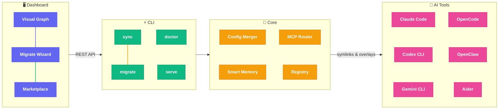

<p align="center">
  <h1 align="center">🍄 Mycelium</h1>
  <p align="center"><strong>Universal AI Tool Orchestrator</strong></p>
  <p align="center">Sync skills, MCPs, and memory across all your AI coding tools — from one place.</p>
</p>

<p align="center">
  <a href="https://github.com/conradomateunavarro/mycelium/actions"></a>
  <a href="https://www.npmjs.com/package/@mycelium/cli"></a>
  
  
  = 20" />
  <a href="LICENSE"></a>
  
</p>

---

Just like the fungal networks beneath forest floors connect trees and share nutrients freely, **Mycelium** connects your AI coding tools and shares configurations across all of them. One config to rule them all.

## 🏗️ Architecture



## ✨ Features

| | Feature | Description |
|---|---------|-------------|
| 🔄 | **Zero-Friction Migration** | `mycelium migrate` scans all tools and imports configs automatically |
| 🧠 | **Smart Memory** | Compression, deduplication, and scoped cross-tool memory sync |
| 📦 | **SKILL.md Standard** | Parse and share community skills; browse 160K+ from marketplace |
| 🌐 | **MCP Routing** | Auto-detect project context and route MCP servers accordingly |
| 🖥️ | **Interactive Dashboard** | React Flow graph with toggles, migration wizard, and marketplace |
| 📸 | **Snapshots** | Create, restore, and manage named config snapshots |
| 🏗️ | **Presets & Teams** | Save project profiles; configure multi-agent team setups |
| 🔌 | **Pluggable Marketplace** | Add/remove sources dynamically; manage plugins from CLI or dashboard |
| 💻 | **Multi-PC Sync** | Git-based push/pull with machine overrides and env templates |
| 🩺 | **Doctor** | Health checks for MCP connectivity, tool versions, and memory |

## 🚀 Quick Start

```bash
# Install
npm install -g mycelium

# One command sets everything up
mycelium init
```

`mycelium init` automatically detects your tools, creates a private GitHub config repo, migrates existing configs, and syncs everything.

> [!TIP]
> On a new machine, just run `mycelium init` again — it finds your existing repo and pulls everything down.

### How It Works

🛠️ **Install** → 🔍 **Detect tools** → 📥 **Migrate configs** → 🔗 **Sync everywhere** → 🚀 **Done**

```bash
# Daily workflow
mycelium sync              # Push config to all tools
mycelium sync --watch      # Auto-sync on file changes
mycelium push              # Save to GitHub
mycelium pull              # Pull on another machine
mycelium serve             # Launch dashboard at localhost:3378
```

> [!NOTE]
> Mycelium never overwrites your tool configs. It uses overlay files (symlinks + managed sections) that tools pick up alongside their originals.

## 📋 CLI Commands

Alias: `myc` (e.g., `myc sync`)

| Command | Description |
|---------|-------------|
| `mycelium init` | Auto-setup: detect tools, create repo, migrate, sync |
| `mycelium sync [--watch]` | Sync to all tools (with optional watch mode) |
| `mycelium status` | Show sync status across all tools |
| `mycelium doctor` | Health checks and diagnostics |
| `mycelium migrate [--apply]` | Scan tools and import configs (dry-run by default) |
| `mycelium migrate --clear` | Remove mycelium-managed entries |
| `mycelium snapshot create/restore/list/delete` | Manage config snapshots |
| `mycelium preset save/load/list` | Save and load project presets |
| `mycelium teams generate` | Generate agent team manifests |
| `mycelium marketplace list/add/remove` | Manage marketplace sources |
| `mycelium marketplace plugins/enable/disable` | Manage installed plugins |
| `mycelium push / pull` | Git-based multi-PC sync |
| `mycelium env list / setup` | Manage environment variables |
| `mycelium add / remove / enable / disable` | Manage skills, MCPs, plugins |
| `mycelium serve` | Start dashboard API server (port 3378) |

## 🔧 Supported Tools

| Tool | Skills | MCPs | Memory | Config Format |
|------|--------|------|--------|---------------|
| Claude Code | `~/.claude/skills` | JSON | `CLAUDE.md` | JSON |
| Codex CLI | `~/.codex/skills` | TOML | `AGENTS.md` | TOML |
| Gemini CLI | `~/.gemini/extensions` | JSON | `GEMINI.md` | JSON |
| OpenCode | `~/.config/opencode/plugin` | JSON | `context.md` | JSON |
| OpenClaw | `~/.openclaw/skills` | JSON | `MEMORY.md` | JSON |
| Aider | `~/.aider/plugins` | YAML | `MEMORY.md` | YAML |

## 🖥️ Dashboard

Launch with `mycelium serve`, then open `http://localhost:3378`:

- **Graph View** — Visual map of tools, plugins, skills, MCPs, and memory
- **Toggle Switches** — Enable/disable directly from graph nodes
- **Migration Wizard** — Step-by-step import from installed tools
- **Marketplace Browser** — Search and install from configured sources
- **Plugin Management** — Click plugin nodes for detail panels

## 🔍 Troubleshooting

| Problem | Solution |
|---------|----------|
| `sync` fails for a tool | Run `mycelium doctor` to check tool detection |
| Skills not appearing | Verify tool supports symlinked skills directories |
| MCP not connecting | Check with `mycelium status`; verify config format |
| Dashboard not loading | Run `mycelium serve` first (port 3378) |
| Watch mode issues on Linux | `recursive: true` unsupported; use manual sync |
| Migration conflicts | Use `mycelium migrate --strategy interactive` |
| Push/pull fails | Ensure Git remote is configured in `~/.mycelium` |
| Missing env vars after pull | Run `mycelium env setup` and edit `.env.local` |

## 📚 Documentation

| Document | Description |
|----------|-------------|
| [Architecture](docs/ARCHITECTURE.md) | Design philosophy, overlay sync strategy, migration design |
| [Overlay Sync](docs/OVERLAY-SYNC.md) | How skills, MCPs, and memory are synced to each tool |
| [Multi-PC Sync](docs/MULTI-PC.md) | Git-based sync, machine overrides, env templates |
| [Migration Guide](docs/MIGRATION.md) | Detailed migration workflow, strategies, and cleanup |
| [Contributing](CLAUDE.md) | Developer guide: structure, conventions, testing |

## 📄 License

**MIT** — Just like real mycelium shares nutrients between trees without charging a subscription fee, this project is completely free. No premium spores, no enterprise mushroom edition. Fork it, grow it, spread it. 🍄
