# 🍄 Mycelium

**Universal AI Tool Orchestrator** — Sync skills, MCPs, and memory across Claude Code, Codex CLI, Gemini CLI, OpenCode, OpenClaw, and Aider.

## What is Mycelium?

Just like the fungal networks beneath forest floors connect trees and share nutrients freely, Mycelium connects your AI coding tools and shares configurations across all of them. One config to rule them all.

## Architecture

```mermaid
graph TD
    subgraph Dashboard["Interactive Dashboard (localhost:3377)"]
        Graph["React Flow Graph"]
        Toggle["Toggle Switches"]
        Migrate["Migration Wizard"]
        Market["Marketplace Browser"]
    end

    subgraph CLI["CLI Engine"]
        Sync["mycelium sync --watch"]
        Doctor["mycelium doctor"]
        Presets["mycelium preset"]
        Teams["mycelium teams"]
        MigrateCmd["mycelium migrate"]
        MarketCmd["mycelium marketplace"]
        ServeCmd["mycelium serve"]
    end

    subgraph Core["Core"]
        ConfigMerge["Config Merger"]
        Symlinks["Symlink Manager"]
        MemoryEngine["Smart Memory"]
        SkillParser["SKILL.md Parser"]
        MCPRouter["MCP Router"]
        ConflictDet["Conflict Detector"]
        Registry["Marketplace Registry"]
        Migrator["Migrator"]
    end

    subgraph API["API Server (localhost:3378)"]
        REST["REST Endpoints"]
    end

    subgraph Tools["AI Tools"]
        CC["Claude Code"]
        CX["Codex CLI"]
        GM["Gemini CLI"]
        OC["OpenCode"]
        OW["OpenClaw"]
        AI["Aider"]
    end

    Dashboard --> API
    API --> CLI
    CLI --> Core
    Core --> Tools
```



## Features

- **Zero-Friction Migration** — `mycelium migrate` scans all installed tools and imports skills, MCPs, and memory automatically
- **Smart Memory** — Compression, deduplication, and cross-tool memory sync with configurable scopes
- **SKILL.md Standard** — Parse and share community skills; access 160K+ skills from SkillsMP
- **MCP Registry + Intelligent Routing** — Auto-detect project context and route MCPs accordingly
- **Interactive Dashboard** — React Flow visualization with toggle switches, migration wizard, and marketplace browser
- **Presets & Profiles** — Save and load one-click project configurations
- **Agent Team Management** — Configure and deploy multi-agent team setups
- **Conflict Detection** — Detect and resolve config conflicts across global, machine, and project levels
- **Watch Mode** — `mycelium sync --watch` for real-time config syncing
- **Doctor** — Health checks for MCP connectivity, tool versions, and memory size
- **Pluggable Marketplace Registry** — Add/remove marketplace sources dynamically; auto-discovers from installed plugins
- **Plugin Management** — Enable/disable entire plugins or individual skills from dashboard or CLI
- **API Server** — `mycelium serve` exposes REST API on port 3378 for dashboard connectivity
- **Marketplace Provenance** — Migration tracks which marketplace and plugin each skill came from
- **Skills Sync** — Share skills across all your AI tools via symlinks
- **MCP Injection** — Configure MCP servers once, deploy everywhere
- **Memory Scoping** — Control what each tool knows (shared, coding-only, personal)
- **Config Merging** — Project configs add to globals, not replace them
- **Tool Detection** — Automatically detects which AI tools you have installed

## Quick Start

```bash
# Install globally
npm install -g mycelium

# Initialize
mycelium init --global

# Migrate existing configs from all tools
mycelium migrate
mycelium migrate --apply

# Check status
mycelium status

# Sync everything
mycelium sync
```

## CLI Commands

| Command | Description |
|---------|-------------|
| `mycelium init` | Initialize Mycelium configuration |
| `mycelium sync` | Sync skills, MCPs, and memory to all tools |
| `mycelium sync --watch` | Watch for config changes and sync in real-time |
| `mycelium status` | Show sync status across all tools |
| `mycelium add skill <name>` | Add a skill from GitHub or local path |
| `mycelium add mcp <name>` | Add an MCP server |
| `mycelium enable <name>` | Enable a skill or MCP |
| `mycelium disable <name>` | Disable a skill or MCP |
| `mycelium doctor` | Check system health and fix issues |
| `mycelium migrate` | Scan all tools and show migration plan (dry-run) |
| `mycelium migrate --apply` | Execute migration, importing configs |
| `mycelium migrate --clear` | Remove all mycelium-managed configs (dry-run) |
| `mycelium preset save <name>` | Save current config as a named preset |
| `mycelium preset load <name>` | Load and apply a preset |
| `mycelium preset list` | List saved presets |
| `mycelium teams generate` | Generate agent team manifests |
| `mycelium serve` | Start dashboard API server (port 3378) |
| `mycelium marketplace list` | List configured marketplace sources |
| `mycelium marketplace add <name>` | Add a remote marketplace |
| `mycelium marketplace remove <name>` | Remove a user-added marketplace |
| `mycelium marketplace plugins` | List installed plugins |
| `mycelium marketplace enable <plugin>` | Enable a plugin |
| `mycelium marketplace disable <plugin>` | Disable a plugin |

## Dashboard

Launch the interactive dashboard at `http://localhost:3377`:

- **Graph View** — Visual map of all tools, plugins, skills, MCPs, and memory connections
- **Toggle Switches** — Enable/disable skills and MCPs directly from graph nodes
- **Plugin Nodes** — Click plugin nodes to manage individual skills with detail panel
- **Migration Wizard** — Step-by-step import from all installed tools
- **Marketplace Browser** — Search and install from dynamically configured marketplace sources
- **Live Status** — Real-time API connection status and system health

## Supported Tools

- Claude Code
- Codex CLI
- Gemini CLI
- OpenCode
- OpenClaw
- Aider

## License

**MIT** — Just like real mycelium shares nutrients between trees without charging a subscription fee, this project is completely free. No premium spores, no enterprise mushroom edition. Fork it, grow it, spread it. 🍄
