# 🍄 Mycelium

**Universal AI Tool Orchestrator** — Sync skills, MCPs, and memory across Claude Code, Codex CLI, Gemini CLI, OpenCode, OpenClaw, and Aider.

## What is Mycelium?

Just like the fungal networks beneath forest floors connect trees and share nutrients freely, Mycelium connects your AI coding tools and shares configurations across all of them. One config to rule them all.

## Architecture

```mermaid
graph TD
    subgraph Dashboard["Interactive Dashboard (localhost:3377)"]
        Graph["React Flow Graph"]
        Toggle["Toggle Switches"]
        Migrate["Migration Wizard"]
        Market["Marketplace Browser"]
    end

    subgraph CLI["CLI Engine"]
        Sync["mycelium sync --watch"]
        Doctor["mycelium doctor"]
        Presets["mycelium preset"]
        Teams["mycelium teams"]
        MigrateCmd["mycelium migrate"]
        MarketCmd["mycelium marketplace"]
        ServeCmd["mycelium serve"]
    end

    subgraph Core["Core"]
        ConfigMerge["Config Merger"]
        Symlinks["Symlink Manager"]
        MemoryEngine["Smart Memory"]
        SkillParser["SKILL.md Parser"]
        MCPRouter["MCP Router"]
        ConflictDet["Conflict Detector"]
        Registry["Marketplace Registry"]
        Migrator["Migrator"]
    end

    subgraph API["API Server (localhost:3378)"]
        REST["REST Endpoints"]
    end

    subgraph Tools["AI Tools"]
        CC["Claude Code"]
        CX["Codex CLI"]
        GM["Gemini CLI"]
        OC["OpenCode"]
        OW["OpenClaw"]
        AI["Aider"]
    end

    Dashboard --> API
    API --> CLI
    CLI --> Core
    Core --> Tools
```



## Features

- **Zero-Friction Migration** — `mycelium migrate` scans all installed tools and imports skills, MCPs, and memory automatically
- **Smart Memory** — Compression, deduplication, and cross-tool memory sync with configurable scopes
- **SKILL.md Standard** — Parse and share community skills; access 160K+ skills from SkillsMP
- **MCP Registry + Intelligent Routing** — Auto-detect project context and route MCPs accordingly
- **Interactive Dashboard** — React Flow visualization with toggle switches, migration wizard, and marketplace browser
- **Presets & Profiles** — Save and load one-click project configurations
- **Agent Team Management** — Configure and deploy multi-agent team setups
- **Conflict Detection** — Detect and resolve config conflicts across global, machine, and project levels
- **Watch Mode** — `mycelium sync --watch` for real-time config syncing
- **Doctor** — Health checks for MCP connectivity, tool versions, and memory size
- **Pluggable Marketplace Registry** — Add/remove marketplace sources dynamically; auto-discovers from installed plugins
- **Plugin Management** — Enable/disable entire plugins or individual skills from dashboard or CLI
- **API Server** — `mycelium serve` exposes REST API on port 3378 for dashboard connectivity
- **Multi-PC Sync** — Git-based push/pull with auto-detected machine overrides and env templates
- **Marketplace Provenance** — Migration tracks which marketplace and plugin each skill came from
- **Skills Sync** — Share skills across all your AI tools via symlinks
- **MCP Injection** — Configure MCP servers once, deploy everywhere
- **Memory Scoping** — Control what each tool knows (shared, coding-only, personal)
- **Config Merging** — Project configs add to globals, not replace them
- **Tool Detection** — Automatically detects which AI tools you have installed

## Quick Start

```bash
# Install globally
npm install -g mycelium

# One command does everything:
mycelium init
```

That's it. `mycelium init` automatically:
1. Detects if `gh` CLI is installed and authenticated
2. Creates a private `mycelium-config` repo on GitHub (or clones existing one)
3. Scans all installed AI tools and migrates their configs
4. Generates `.env.template` for secrets management
5. Auto-detects machine-specific paths
6. Pushes initial config to GitHub

### New Machine Setup

```bash
# If gh CLI is configured (recommended):
mycelium init                           # auto-detects your repo

# Or with explicit repo URL:
mycelium init --repo git@github.com:you/mycelium-config.git

# Or pull into existing setup:
mycelium pull --repo https://github.com/you/mycelium-config.git
```

### Daily Workflow

```bash
mycelium sync          # Push config to all installed tools
mycelium push          # Save changes to GitHub
mycelium pull          # Pull latest on another machine
mycelium serve         # Start dashboard at http://localhost:3378
```

### Zero-Friction Flow

```
FIRST MACHINE                          NEW MACHINE
─────────────                          ───────────
mycelium init                          mycelium init
  ├─ detects gh CLI ✓                    ├─ detects gh CLI ✓
  ├─ creates private repo               ├─ finds existing repo
  ├─ scans tools → migrates             ├─ clones config
  ├─ generates .env.template            ├─ prompts for secrets
  ├─ pushes to GitHub                   ├─ auto-detects paths
  └─ done                               ├─ auto-syncs to tools
                                         └─ done
```

## CLI Commands

See the full [Command Reference](#command-reference) below for all commands including snapshot, overlay sync, and migration flags.

| Command | Description |
|---------|-------------|
| `mycelium init` | Zero-friction auto-setup: detect tools, create repo, migrate, sync |
| `mycelium init --repo <url>` | Clone config from existing git repo |
| `mycelium sync` | Sync skills, MCPs, and memory to all tools |
| `mycelium status` | Show sync status across all tools |
| `mycelium doctor` | Check system health and fix issues |
| `mycelium migrate` | Scan and import configs from all tools |
| `mycelium snapshot create <name>` | Create a named config snapshot |
| `mycelium snapshot restore <name>` | Restore config from a snapshot |
| `mycelium marketplace list` | List marketplace sources |
| `mycelium push` | Push configs to remote Git repo |
| `mycelium pull` | Pull configs and auto-sync |
| `mycelium env list` | Show env var status (set/missing) |
| `mycelium env setup` | Generate .env.local template |
| `mycelium remove skill <name>` | Remove a skill from mycelium |
| `mycelium remove mcp <name>` | Remove an MCP from mycelium |
| `mycelium remove plugin <name>` | Remove all skills from a plugin |
| `mycelium serve` | Start dashboard API server |

## Dashboard

Launch the interactive dashboard at `http://localhost:3377`:

- **Graph View** — Visual map of all tools, plugins, skills, MCPs, and memory connections
- **Toggle Switches** — Enable/disable skills and MCPs directly from graph nodes
- **Plugin Nodes** — Click plugin nodes to manage individual skills with detail panel
- **Migration Wizard** — Step-by-step import from all installed tools
- **Marketplace Browser** — Search and install from dynamically configured marketplace sources
- **Live Status** — Real-time API connection status and system health

## Supported Tools

- Claude Code
- Codex CLI
- Gemini CLI
- OpenCode
- OpenClaw
- Aider

## How Migration Works (Non-Destructive)

Mycelium never overwrites your existing tool configs. Migration reads from tools and writes only to Mycelium's own store. Sync writes overlay files that tools pick up alongside their originals.

```
  Source Tools                    Mycelium Store                  Target Tools
 +--------------+              +------------------+            +--------------+
 | Claude Code  |--scan------->|                  |--overlay-->| Claude Code  |
 | - skills/    |              | ~/.mycelium/     |            | - skills/    |
 | - mcp.json   |              |   skills/        |            | - mcp.json   |
 | - CLAUDE.md  |              |   mcps.yaml      |            | - CLAUDE.md  |
 +--------------+              |   memory/        |            +--------------+
 | Codex CLI    |--scan------->|   snapshots/     |--overlay-->| Codex CLI    |
 | - skills/    |              |   manifest.json  |            | - skills/    |
 | - config.toml|              |                  |            | - config.toml|
 +--------------+              +------------------+            +--------------+
 | Gemini CLI   |--scan------->        |          |--overlay-->| Gemini CLI   |
 +--------------+              +-------v----------+            +--------------+
                               | Snapshot created |
                               | before changes   |
                               +------------------+
```

Key guarantees:
- **Read-only scan**: `mycelium migrate` never modifies source tool configs
- **Snapshot before write**: Every sync creates a snapshot you can restore
- **Overlay, not overwrite**: Symlinks and injected sections are clearly marked
- **Clean removal**: `mycelium migrate --clear` removes only mycelium-managed entries

## Overlay Sync Architecture

When `mycelium sync` runs, it writes to each tool using overlay strategies that preserve existing configs:

```
                    mycelium sync
                         |
          +--------------+--------------+
          |              |              |
     Skills Sync    MCP Injection   Memory Merge
          |              |              |
    +-----v-----+  +----v-----+  +-----v------+
    | Symlink    |  | Section  |  | Append     |
    | into tool  |  | inject   |  | managed    |
    | skills dir |  | into MCP |  | block to   |
    |            |  | config   |  | memory     |
    +-----+-----+  +----+-----+  +-----+------+
          |              |              |
    tool/skills/   tool/mcp.json   tool/MEMORY.md
    my-skill ->    { "mcpServers":  <!-- mycelium:start -->
    ~/.mycelium/     ...injected    ...managed content
    skills/my-skill  }              <!-- mycelium:end -->
```

**Skills**: Symlinked from `~/.mycelium/skills/<name>` into each tool's skills directory.

**MCPs**: Injected into each tool's MCP config file using the tool's native format (JSON, TOML, or YAML).

**Memory**: Appended as a clearly delimited managed block at the end of each tool's memory file.

## Section-Only Sync (Surgical Replace)

For MCP configs and memory files, Mycelium uses section markers to manage only its own content:

```
  Original mcp.json              After mycelium sync
 +--------------------+        +--------------------+
 | {                  |        | {                  |
 |   "mcpServers": {  |        |   "mcpServers": {  |
 |     "user-mcp": {} | <---   |     "user-mcp": {} |  untouched
 |   }                |        |     "my-mcp": {}   |  injected
 | }                  |        |   }                |
 +--------------------+        | }                  |
                               +--------------------+

  Original CLAUDE.md             After mycelium sync
 +--------------------+        +--------------------+
 | # My notes         | <---   | # My notes         |  untouched
 | Custom content     |        | Custom content     |
 +--------------------+        | <!-- mycelium -->   |  marker
                               | Shared memory...   |  managed
                               | <!-- /mycelium -->  |  marker
                               +--------------------+
```

User content is never modified. Only the managed section is replaced on each sync.

## Iterative Test Cycle

The recommended workflow for testing config changes safely:

```
  1. Snapshot         2. Edit             3. Sync            4. Test
 +------------+    +------------+    +------------+    +------------+
 | mycelium   |    | Edit       |    | mycelium   |    | Use your   |
 | snapshot   |--->| mycelium   |--->| sync       |--->| AI tool    |
 | create     |    | configs    |    |            |    | normally   |
 | "before-x" |    |            |    |            |    |            |
 +------------+    +------------+    +-----+------+    +-----+------+
                                           |                 |
                                           |           +-----v------+
                                           |           | Works?     |
                                           |           | YES -> done|
                                           |           | NO -----+ |
                                           |           +----------|-+
                                           |                      |
                                     +-----v------+              |
                                     | mycelium   |<-------------+
                                     | snapshot   |
                                     | restore    |
                                     | "before-x" |
                                     +------------+
```

## Snapshot Storage Structure

Snapshots are stored at `~/.mycelium/snapshots/` with a flat structure:

```
~/.mycelium/
  snapshots/
    before-refactor/
      metadata.json        # SnapshotMetadata (name, date, file list)
      skills/              # Copy of all skills at snapshot time
        my-skill/
          SKILL.md
      mcps.yaml            # MCP config at snapshot time
      memory/              # Memory files at snapshot time
        shared.md
        coding.md
    pre-migration/
      metadata.json
      skills/
      mcps.yaml
      memory/
```

Each snapshot captures the full Mycelium config state. Restoring a snapshot replaces the current `~/.mycelium` config with the snapshot contents.

## Portable vs Non-Portable Configs

Not all configs can be synced across tools. Mycelium distinguishes between portable and non-portable configurations:

| Config Type | Portable | Notes |
|-------------|----------|-------|
| Skills (SKILL.md) | Yes | Symlinked to all enabled tools |
| MCP servers | Yes | Translated to each tool's config format |
| Memory files | Yes | Appended as managed blocks |
| Env vars / feature flags | No | Tool-specific; env vars vary per tool |
| Hooks (PreToolUse, etc.) | No | Claude Code-specific lifecycle events |
| Plugin versions | No | Marketplace-specific metadata |
| Tool-specific settings | No | Keybindings, themes, UI preferences |

Use `mycelium migrate` to see which configs are detected and which are skipped with reasons.

## Command Reference

### Core Commands

| Command | Description |
|---------|-------------|
| `mycelium init` | Initialize Mycelium configuration |
| `mycelium sync` | Sync skills, MCPs, and memory to all tools |
| `mycelium sync --watch` | Watch for config changes and sync in real-time |
| `mycelium sync --overlay` | Write overlay configs without full sync |
| `mycelium sync --skills-only` | Sync only skills |
| `mycelium sync --mcps-only` | Sync only MCP configs |
| `mycelium status` | Show sync status across all tools |
| `mycelium doctor` | Check system health and fix issues |

### Migration Commands

| Command | Description |
|---------|-------------|
| `mycelium migrate` | Scan all tools and show migration plan (dry-run) |
| `mycelium migrate --apply` | Execute migration, importing configs |
| `mycelium migrate --tool <id>` | Migrate from a specific tool only |
| `mycelium migrate --skills-only` | Migrate only skills |
| `mycelium migrate --mcps-only` | Migrate only MCP configs |
| `mycelium migrate --strategy <s>` | Conflict strategy: latest, interactive, all |
| `mycelium migrate --clear` | Remove all mycelium-managed configs (dry-run) |
| `mycelium migrate --clear --apply` | Execute removal of managed configs |

### Snapshot Commands

| Command | Description |
|---------|-------------|
| `mycelium snapshot create <name>` | Create a named snapshot of current config |
| `mycelium snapshot restore <name>` | Restore config from a snapshot |
| `mycelium snapshot list` | List all snapshots |
| `mycelium snapshot delete <name>` | Delete a snapshot |

### Preset and Team Commands

| Command | Description |
|---------|-------------|
| `mycelium preset save <name>` | Save current config as a named preset |
| `mycelium preset load <name>` | Load and apply a preset |
| `mycelium preset list` | List saved presets |
| `mycelium teams generate` | Generate agent team manifests |

### Multi-PC Sync Commands

| Command | Description |
|---------|-------------|
| `mycelium push` | Commit and push `~/.mycelium` to remote |
| `mycelium push --message "msg"` | Push with a custom commit message |
| `mycelium pull` | Pull remote changes, detect overrides, auto-sync |
| `mycelium pull --no-sync` | Pull without running auto-sync |
| `mycelium pull --rescan` | Force re-detect machine overrides |
| `mycelium sync --rescan` | Sync with forced machine override re-detection |
| `mycelium env list` | Show all env vars and their set/missing status |
| `mycelium env setup` | Generate `.env.local` with missing vars |

### Marketplace Commands

| Command | Description |
|---------|-------------|
| `mycelium marketplace list` | List configured marketplace sources |
| `mycelium marketplace add <name>` | Add a remote marketplace |
| `mycelium marketplace remove <name>` | Remove a user-added marketplace |
| `mycelium marketplace plugins` | List installed plugins |
| `mycelium marketplace enable <plugin>` | Enable a plugin |
| `mycelium marketplace disable <plugin>` | Disable a plugin |
| `mycelium serve` | Start dashboard API server (port 3378) |

## Multi-PC Sync

Mycelium uses Git to synchronize configs across machines. Your `~/.mycelium` directory becomes a Git repo that you push and pull between computers.

### Git-Based Sync Setup

```bash
# On your primary machine — initialize and push
cd ~/.mycelium
git init
git remote add origin git@github.com:you/mycelium-config.git
mycelium push
```

### Push / Pull Workflow

```bash
# Push local changes to remote
mycelium push
mycelium push --message "added new MCP server"

# Pull changes on another machine
mycelium pull               # pulls, detects overrides, auto-syncs
mycelium pull --no-sync     # pull only, skip auto-sync
mycelium pull --rescan      # force re-detect machine overrides
```

`mycelium pull` automatically:
1. Runs `git pull` in `~/.mycelium`
2. Checks for missing environment variables
3. Detects machine-specific MCP command overrides (e.g. different binary paths)
4. Runs `mycelium sync` to apply changes to all tools

### Machine Overrides

Different machines may have tools installed at different paths. Mycelium auto-detects this and stores per-hostname overrides at `~/.mycelium/machines/{hostname}.yaml`.

For example, if your shared config references `/opt/homebrew/bin/mcp-server` but the current machine has it at `/usr/local/bin/mcp-server`, Mycelium detects and applies the override automatically during `pull` or `sync --rescan`.

Machine override files are gitignored so each machine keeps its own.

### Environment Template System

Secrets (API keys, tokens) should not be committed to Git. Mycelium tracks a `.env.template` with variable names and descriptions, while `.env.local` (gitignored) holds actual values.

```bash
# See all env vars and their status (set / missing)
mycelium env list

# Generate a .env.local template with missing vars
mycelium env setup
# Then edit ~/.mycelium/.env.local and fill in the values
```

### First-Time Setup on a New PC

```bash
# 1. Install Mycelium
npm install -g mycelium

# 2. Clone your config
git clone git@github.com:you/mycelium-config.git ~/.mycelium

# 3. Pull and auto-detect machine overrides
mycelium pull

# 4. Fill in secrets
mycelium env setup
# Edit ~/.mycelium/.env.local with your API keys

# 5. Sync to all tools
mycelium sync

# 6. Verify everything works
mycelium doctor
```

## Workflow Guide

### First-Time Setup

```bash
# 1. Install and initialize
npm install -g mycelium
mycelium init --global

# 2. Run doctor to check your environment
mycelium doctor

# 3. Import configs from your existing tools
mycelium migrate              # Preview what will be imported
mycelium migrate --apply      # Execute the import

# 4. Sync to all tools
mycelium sync

# 5. Launch dashboard to visualize
mycelium serve &
open http://localhost:3377
```

### Iterative Testing

```bash
# Create a safety snapshot before experimenting
mycelium snapshot create "before-experiment"

# Make changes (add skills, reconfigure MCPs, etc.)
mycelium add skill my-new-skill
mycelium sync

# Test with your AI tools...
# If something breaks:
mycelium snapshot restore "before-experiment"
mycelium sync
```

### Daily Use

```bash
# Start watch mode for automatic syncing
mycelium sync --watch

# Add skills from the marketplace
mycelium marketplace list
# Browse and install from the dashboard

# Save working configs as a preset for later
mycelium preset save "my-project"
```

## Troubleshooting

| Problem | Cause | Solution |
|---------|-------|----------|
| `mycelium sync` fails for a tool | Tool not installed or config path changed | Run `mycelium doctor` to check tool detection |
| Skills not appearing in tool | Symlink not followed by tool | Check tool supports symlinked skills directories |
| MCP server not connecting | Config format mismatch | Verify with `mycelium status`; check tool's MCP config format |
| Memory content duplicated | Multiple syncs without markers | Run `mycelium migrate --clear --apply` then `mycelium sync` |
| Dashboard not loading | API server not running | Run `mycelium serve` first (port 3378) |
| Snapshot restore failed | Snapshot corrupted or deleted | Check `~/.mycelium/snapshots/` for intact metadata.json |
| Watch mode not detecting changes | Linux: recursive watch not supported | Use polling fallback or manual `mycelium sync` |
| Migration conflicts | Same skill/MCP in multiple tools | Use `--strategy interactive` to pick per conflict |
| `mycelium push` fails | No Git remote configured in `~/.mycelium` | Run `git -C ~/.mycelium remote add origin <url>` |
| `mycelium pull` warns missing env vars | Secrets not yet configured on this machine | Run `mycelium env setup` then edit `~/.mycelium/.env.local` |
| MCP command not found after pull | Binary path differs between machines | Run `mycelium pull --rescan` or `mycelium sync --rescan` |
| Machine overrides not applying | Override file missing or stale | Run `mycelium sync --rescan` to force re-detection |

## License

**MIT** — Just like real mycelium shares nutrients between trees without charging a subscription fee, this project is completely free. No premium spores, no enterprise mushroom edition. Fork it, grow it, spread it. 🍄
